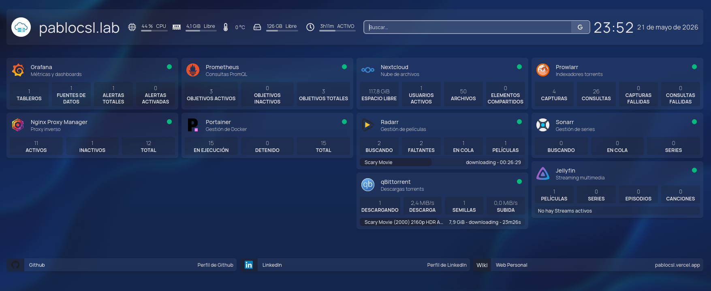

# Homelab Containers

Este repositorio contiene la simulación de un entorno Homelab completo desplegado en una máquina virtual utilizando Docker Compose. Incluye servicios de red, monitorización, automatización multimedia, almacenamiento en la nube y gestión de contenedores, todo orquestado de forma modular.
